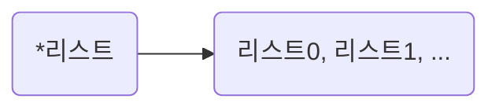

# ch.4 반복문

## 4-1 리스트와 반복문

### 리스트란?

리스트란 여러가지 자료를 저장할 수 있는 자료다. 리스트는 숫자, 문자, 수식 같은 자료들을 모아서 사용할 수 있게 해주는 특별한 형태의 자료다.

**리스트 선언 예시**
```
array = [273, 32, 103, "문자열", True, False]
print(array)
```

- 실행 결과
```
[273, 32, 103, '문자열', True, False]
```

### 리스트 선언하고 요소에 접근하기

파이썬에서 리스트를 생성하는 방법은 대괄호[]에 자료를 쉼표로 구분해서 입력하면 된다. 대괄호[] 내부에 넣는 자료를 요소(element)라고 한다.

```
[요소, 요소, 요소 ...]
```


```
[1, 2, 3, 4] #숫자로만 구성된 리스트
["안", "녕", "하", "세", "요"] #문자열만으로 구성된 리스트
[273, 32, 103, "문자열", True, False] #여러 자료형으로 구성된 리스트
```

리스트 안에 있는 요소를 각각 사용하려면 리스트 이름 바로 뒤에 대괄호[]를 입력하고, 자료의 위치를 나타내는 숫자를 입력한다. 
```
list_a = [273, 32, 103, "문자열", True, False]
```

이때 리스트 기호인 대괄호[] 안에 들어간 숫자를 인덱스(index)라고 부른다. 
```
>>> list_a = [273, 32, 103, "문자열", True, False]
>>> list_a[0]
273
>>> list_a[1]
32
>>> list_a[2]
103
>>> list_a[1:3]
[32, 103]
```

list_a[1:3]의 [1:3]은 문자열 범위 선택 연산자에서 설명했듯이 1번째 글자부터 3번째 글자를 선택하는 것이 아니라 그 앞의 숫자, 2번째 글자를 선택한다. 

리스트의 특정 요소를 변경할 수도 있다. 다음과 같이 입력하면 "변경"이라는 문자열을 0번째에 대입하여 요소를 변경하고 있다. 

```
>>> list_a=[273, 32, 103, "문자열", True, False]
>>> list_a[0] = "변경"
>>> list_a
['변경', 32, 103, '문자열', True, False]
```

### 리스트의 다양한 사용 방법

**첫째, 대괄호 안에 음수를 넣어 뒤에서부터 요소를 선택할 수 있다.**

리스트는 대괄호 안에 음수를 넣어 뒤에서부터 요소를 선택할 수 있다. 

```
>>> list_a = [273, 32, 103, "문자열", True, False]
>>> list_a[-1]
False
>>> list_a[-2]
True
>>> list_a[-3]
'문자열'
```

**둘째, 리스트의 접근 연산자를 다음과 같이 이중으로 사용할 수 있다.**

아래와 같은 리스트가 있다고 할 때 list_a[3]을 지정하면 "문자열"을 꺼내오고 list_a[3][0]을 지정하면 3번째에서 가져온 "문자열"에서 다시 0번째를 가져와 출력한다.

```
>>> list_a = [273, 32, 103 ,"문자열", True, False]
>>> list_a[3]
'문자열'
>>> list_a[3][0]
'문'
```

**셋째, 리스트 안에 리스트를 사용할 수 있다.**

아래와 같이 기술하면 list_a는 리스트 세개를 가지는 리스트로 만들어진다. 
```
>>> list_a = [[1,2,3],[4,5,6],[7,8,9]]
>>> list_a[1]
[4, 5, 6]
>>> list_a[1][1]
5
```

### 리스트에서의 IndeXError 예외

문자열에서 IndexError 예외를 살펴보았다. 이번에는 리스트에서 IndexError 예외를 살펴보겠다. 이 예외는 리스트의 길이를 넘는 인덱스로 요소에 접근하려고 할 때 발생하는 예외다. 요소가 존재하지 않는 위치에서 요소를 꺼내려고 하니 예외가 발생한다.

```
list_a = [273, 32, 103]
list_a[3]
```
- 실행 결과


리스트에 [3]번째 요소가 없으므로 아래와 같이 IndexError 예외가 발생한다. 

### 리스트 연산하기 : 연결(+), 반복(*), len()

이전에 문자열에 적용할 수 있는 연산자는 리스트에서도 활용할 수 있다. 문자열과 리스트는 굉장히 비슷한 자료형으로, 사용할 수 있는 연산자와 함수도 비슷하다. 

##### 예제
```
list_a = [1, 2, 3]
list_b = [4, 5, 6]

print("# 리스트")
print("list_a =", list_a)
print("list_b =", list_b)
print()
#기본연산자

print("# 리스트 기본 연산자")
print("list_a + list_b=", list_a + list_b)
print("list_a * 3 =", list_a * 3)
print()

#함수
print("# 길이 구하기")
print("len(list_a)=", len(list_a))
```

- 실행 결과
```
# 리스트
list_a = [1, 2, 3]
list_b = [4, 5, 6]

# 리스트 기본 연산자
list_a + list_b= [1, 2, 3, 4, 5, 6]
list_a * 3 = [1, 2, 3, 1, 2, 3, 1, 2, 3]

# 길이 구하기
len(list_a)= 3
```

**문자열 연결 연산자 +** : list_a와 list_b의 자료를 연결한다.
**문자열 반복 연산자 \*** : list_a의 자료를 3번 반복한다.
**len() 함수** : len() 함수는 괄호 내부에 문자열을 넣으면 문자열의 글자 수 (=길이)를 세어주지만, 리스트 변수를 넣으면 요소의 개수를 세어준다.

### 리스트에 요소 추가하기 : append(), insert()

리스트에 요소를 추가할 때는 두 가지 방법이 있다. 한 가지는 append()함수를 활용하는 것으로 **리스트 뒤에 요소를 추가한다**. 
```
리스트명.append(요소)
```

다른 한 가지는 insert() 함수를 활용하는 것으로 리스트의 중간에 요소를 추가한다.
```
리스트명.insert(위치, 요소)
```

##### 예제

```
# 리스트를 선언한다.
list_a = [1, 2, 3]

# 리스트 뒤에 요소 추가하기
print("# 리스트 뒤에 요소 추가하기")
list_a.append(4)
list_a.append(5)
print(list_a)
print()

# 리스트 중간에 요소 추가하기
print("# 리스트 중간에 요소 추가하기")
list_a.insert(0, 10)
print(list_a)
```

- 실행 결과
```
# 리스트 뒤에 요소 추가하기
[1, 2, 3, 4, 5]

# 리스트 중간에 요소 추가하기
[10, 1, 2, 3, 4, 5]
```

append() 함수와 insert() 함수는 리스트에 요소 하나를 추가한다. 한 번에 여러 요소를 추가하고 싶을 땐 **extend()** 함수를 사용한다. extend()함수는 매개변수로 리스트를 입력하는데, 원래 리스트 뒤에 새로운 리스트의 요소를 모두 추가한다. 
```
>>> list_a = [1, 2, 3]
>>> list_a.extend([4, 5, 6])
>>> print(list_a)
[1, 2, 3, 4, 5, 6]
```

### 리스트 연결 연산자와 요소 추가의 차이

리스트 연결 연산자와 extend() 함수는 비슷한 형태로 동작한다. 리스트와 리스트를 연겨랗는 기능은 동일한데, 한 가지 큰 차이점이 있다. 

```
>>> list_a = [1, 2, 3]
>>> list_a.extend([4, 5, 6])
>>> print(list_a)
[1, 2, 3, 4, 5, 6]
>>> list_a = [1, 2, 3]
>>> list_b = [4, 5, 6]
>>> list_a + list_b   # 리스트를 연결 연산자로 연결하니,
[1, 2, 3, 4, 5, 6]    # 실행 결과로 [1, 2, 3, 4, 5, 6]이 나왔다.
>>> list_a
[1, 2, 3]             # list_a에는 어떠한 변화도 없다(비파괴적 처리).
>>> list_b            # list_b에는 어떠한 변화도 없다(비파과적 처리).
[4, 5, 6]
```

리스트 연결 연산자는 연결 결과로 [1, 2, 3, 4, 5, 6]을 출력하고 있으며, 원본에 어떠한 변화도 없다는 걸 확인 할 수 있다. 
이어서 extend() 함수를 사용해 보겠다.

```
>>> list_a = [1, 2, 3]
>>> list_b = [4, 5, 6]
>>> list_a.extend(list_b)  # 실행 결과로 아무 것도 출력하지 않았다.
>>> print(list_a)
[1, 2, 3, 4, 5, 6]         # 앞에 입력했던 list_a 자체에 직접적인 변화가 있다(파괴적 처리).
>>> print(list_b)
[4, 5, 6]
```

리스트 연결 연산자 (list_a + list_b)만으로는 list_a에 어떠한 영향도 주지 않는다. 하지만 extend()함수를 사용하면 list_a에 직접적인 영향을 준다.

리스트 연결 연산자와 같이 원본에 어떠한 영향을 주지 않는 것을 **비파괴적**이라고 표현하고,

append(), insert(), extend() 함수와 같이 리스트에 직접적인 영향을 주는 함수 또는 연산을 **파괴적**이라고 표현한다. 

원래 자료는 비파괴적으로 사용하는 것이 편리하다. 비파괴적으로 사용하면 원본도 활용할 수 있고, 새로운 결과도 활용할 수 있으므로 선택지가 더 넓기 때문이다. 그래서 기본 자료형(숫자, 문자열, 불)과 관련된 모든 것드른 비파괴적으로 작동한다.

하지만 리스트의 용량이 매우 커질 수도 있다. 프로그래밍 언어 입장에서 용량이 얼마나 큰지도 모르는 것을 '원본과 결과'라는 두 가지로 생성하는 것은 위험할 수 있다. 그래서 파이썬 프로그래밍 언어는 원본을 직접적으로 조작하는 기능을 제공해서 이러한 위험을 피하는 것이다. 

### 리스트에서 요소 제거하기

파이썬에서 리스트의 요소를 제거하는 방법은 크게 두가지로 나뉜다.

1. 인덱스로 제거하기
2. 값으로 제거하기

### 인덱스로 제거하기 : del 키워드, pop()

인덱스로 제거한다는 것은 '리스트의 2번째 요소를 제거해주세요'처럼 **요소의 위치**를 기반으로 요소를 제거한다. **del 키워드** 또는 **pop()** 함수를 사용한다. 

del 키워드는 다음과 같은 구문을 이용하며 리스트의 특정 인덱스에 있는 요소를 제거한다. 
```
del 리스트명[인덱스]
```

pop() 함수 또한 제거할 위치에 있는 요소를 제거하는데, 매개변수를 입력하지 않으면 -1이 들어가는 것으로 취급해서 마지막 요소를 제거한다. 
```
리스트명.pop(인덱스)
```

##### 예제
```
list_a = [0, 1, 2, 3, 4, 5]
print("# 리스트의 요소를 하나 제거하기")

# 제거 방법[1] - del 키워드
del list_a[1]
print("del list_a[1]:", list_a)

# 제거 방법[2] -pop() 함수에 매개변수 입력
list_a.pop(2)
print("pop(2):", list_a)

# 제거 방법[3] - pop() 함수에 매개변수 입력하지 않음
list_a.pop()
print("pop():", list_a)
```

- 실행 결과
```
# 리스트의 요소를 하나 제거하기
del list_a[1]: [0, 2, 3, 4, 5]
pop(2): [0, 2, 4, 5]
pop(): [0, 2, 4]
```

del 키워드를 사용할 경우에는 범위를 지정해 리스트의 요소를 한꺼번에 제거할 수도 있다. [3:6]을 지정하면 마지막 요소를 포함하지 않는다. 
```
>>> list_b = [0, 1, 2, 3, 4, 5, 6]
>>> del list_b[3:6]
>>> list_b
[0, 1, 2, 6]
```

범위를 한쪽을 입력하지 않으면 지정한 위치를 기준으로 한쪽을 전부 제거해 버릴 수도 있다. [:3]을 지정하면 3을 기준(3번째 불포함)으로 왼쪽을 모두 제거한다. 
```
>>> list_c = [0, 1, 2, 3, 4, 5, 6]
>>> del list_c[:3]
>>> list_c
[3, 4, 5, 6]
```
[3:]을 지정하면 3을 기준(3번째 포함)으로 오른쪽을 모두 제거한다. 
```
>>> list_d = [0, 1, 2, 3, 4, 5, 6]
>>> del list_d[3:]
>>> list_d
[0, 1, 2]
```

### 리스트 슬라이싱

리스트에 [:] 연산자로 리스트 범위를 지정하여 여러 요소를 선택하는 것을 **슬라이싱**이라고 한다. 리스트 슬라이싱은 다음과 같은 형태로 사용한다.
```
리스트[시작_인덱스:끝_인덱스:단계]
```

문자열 슬라이싱과 사용법이 같다. 슬라이싱은 마지막 위치에 "단계"라는 부분을 추가할 수 있다. 단계를 사용하면 지정한 숫자만큼 인덱스를 건너뛰며 요소를 가져온다. 
```
>>> numbers = [1, 2, 3, 4, 5, 6, 7, 8]
>>> numbers[0:5:2]      # 시작 인덱스와 끝 인덱스는 자동으로 "전부"가 지정된다. 
[1, 3, 5]
>>> numbers = [1, 2, 3, 4, 5, 6, 7, 8]
>>> numbers[::-1]       # 단계가 -1이므로 반대로 출력한다. 
[8, 7, 6, 5, 4, 3, 2, 1]
```

### 값을 제거하기 : remove()

두 번째 방법은 값으로 제거하는 거다. 말 그래도 '리스트 내부에 있는 2를 제거해 주세요.'처럼 값을 지정해서 제거하는 것이다. 이때는 remove() 함수를 사용한다.
```
리스트.remove(요소)
```

```
>>> list_c = [1, 2, 1, 2]  # 리스트 선언하기
>>> list_c.remove(2)       # 리스트의 요소를 값으로 제거하기
>>> list_c
[1, 1, 2]
```

remove() 함수로 지정한 값이 리스트 내부에 여러 개 있어도 가장 먼저 발견되는 하나만 제거한다. 위의 예제를 보면 리스트에 2가 두 개 있는데 앞 쪽에 있는 2 하나만 제거되는 것을 알 수 있다. 

만약 리스트에 중복된 여러 개의 값을 모두 제거하려면 반복문과 조합해서 사용해아 한다. 

### 모두 제거하기 : clear()
리스트 내부의 요소를 모두 제거할 때는 clear() 함수를 사용한다. 
```
리스트.clear()
```
```
>>> list_d = [0, 1, 2, 3, 4, 5]
>>> list_d.clear()
>>> list_d
[]   # 요소가 모두 제거되었다. 
```

### 리스트 정렬하기 : sort()

리스트 요소를 정렬하고 싶을 때 sort() 함수를 사용한다. 기본 오름차순 정렬이다. 
```
리스트.sort()
```

```
>>> list_e = [52, 273, 103, 32, 275, 1, 7]
>>> list_e.sort()  # 오름차순 정렬
>>> list_e
[1, 7, 32, 52, 103, 273, 275]
>>> list_e.sort(reverse = True)    # 내림차순 정렬
>>> list_e
[275, 273, 103, 52, 32, 7, 1]
```

지금까지 살펴보았던 모든 리스트의 함수는 파괴적으로 동작한다. 

### 리스트 내부에 있는지 확인하기 : in / not in 연산자

파이썬은 in 연산자를 사용하면 특정 값이 리스트 내부에 있는지 확인하는 방법을 제공한다. 

```
값 in 리스트
```

```
>>> list_a = [273, 32, 103, 57, 52]
>>> 273 in list_a
True
>>> 99 in list_a
False
>>> 100 in list_a
False
>>> 52 in list_a
True
```

리스트 내부에 값이 있으면 True, 없으면 False를 출력하는 걸 확인할 수 있다. 추가적으로 not in 연산자도 있다. not in 연산자는 리스트 내부에 해당 값이 없는지 확인하는 연산자로, in 연산자와 정확하게 반대로 동작한다. 

```
>>> list_a = [273, 32, 103, 57, 52]
>>> 273 not in list_a
False
>>> 99 not in list_a
True
>>> 100 not in list_a
True
>>> 52 not in list_a
False
>>> not 273 in list_a
False
```

### for 반복문 : 리스트와 함께 사용하기

for 반복문의 기본 형태는 다음과 같다.
```
for 반복자 in 반복할 수 있는 것:
    코드
```

반복할 수 있는 것에는 **문자열, 리스트, 딕셔너리, 범위 등**이 있다. 

##### 예제
```
# 리스트를 선언하다.
array = [273, 32, 103, 57, 52]

# 리스트에 반복문을 적용한다.
for element in array:
    #출력한다.
    print(element)
```

- 실행 결과
```
273
32
103
57
52
```

for 반복문은 리스트에 있는 요소 하나하나가 element 변수에 들어가며, 차례차례 반복하게 된다. print() 함수로 element를 출력하므로 리스트 요소를 차례차례 출력하게 된다. 

### for 반복문과 문자열

for 반복문은 문자열을 함께 사용할 수도 있다. 문자열을 for 반복문의 뒤에 넣으면 글자 하나하나에 반복이 사용된다. 

```
>>> for character in "안녕하세요":
        print("-", character)
```

- 실행 결과
```
- 안
- 녕
- 하
- 세
- 요
```


### 중첩 리스트와 중첩 반복문

반복문을 여러 겹 중첩해 사용하면 중첩 반복문이라고 부른다. 중첩 반복문은 일반적으로 n-차원 처리를 할 때 사용한다.

예를 들어 [1, 2, 3]처럼 리스트가 한 겹으로 감싸진 리스트를 **1차원 리스트**, [[1, 2, 3], [4, 5, 6]]처럼 두 겹으로 감싸진 리스트를 **2차원 리스트**라고 한다. 이러한 n-차원 리스트 요소를 모두 확인하려면 반복문을 n번 중첩해야한다.

##### 예제 - 2차원 리스트에서 반복문 한번 사용하기
```
list_of_list = [
    [1, 2, 3],
    [4, 5, 6, 7],
    [8, 9]
]

for items in list_of_list:
    print(items)
```

- 실행 결과
```
[1, 2, 3]
[4, 5, 6, 7]
[8, 9]
```

##### 예제 - 2차원 리스트에서 반복문 두번 사용하기
```
list_of_list = [
    [1, 2, 3],
    [4, 5, 6, 7],
    [8, 9]
]

for items in list_of_list:
    for item in items:
        print(items)
```

- 실행 결과
```
[1, 2, 3]
[1, 2, 3]
[1, 2, 3]
[4, 5, 6, 7]
[4, 5, 6, 7]
[4, 5, 6, 7]
[4, 5, 6, 7]
[8, 9]
[8, 9]
```

### 전개 연산자

전개 연산자를 사용하면 리스트 내용을 전개해서 입력할 수 있다. 리스트 앞에 **\*기호**를 사용하여 다음과 같은 형태로 리스트 요소를 전개히여 입력한 것과 같은 효과를 낸다. 



